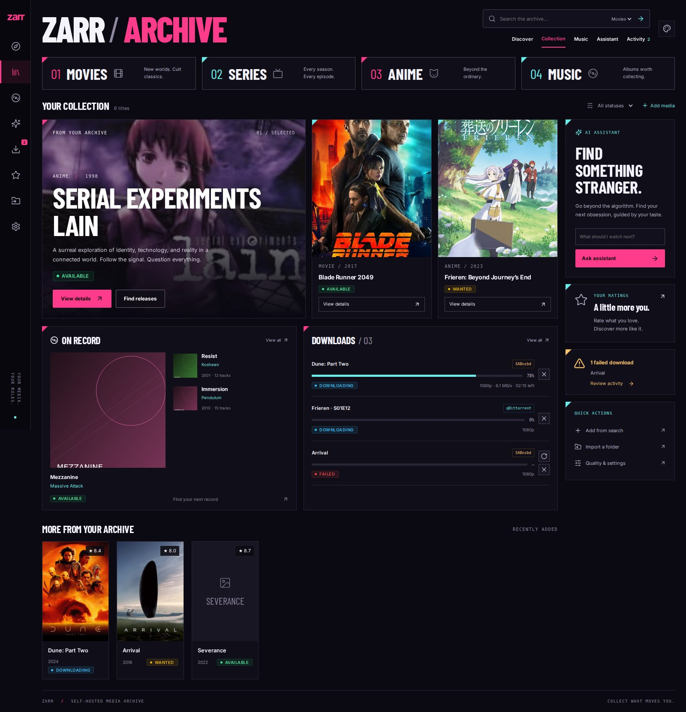

# Neon Archive

The new default presentation implements concept 04: a dark media archive with magenta/cyan accents, condensed Barlow headings, Inter interface text, opaque panels, and asymmetric artwork. The Collection dashboard uses real library, music, and download API responses. The same shell and design tokens apply throughout the app.

## Review screenshots

These browser screenshots use representative fixture data, sample poster artwork, and placeholder album artwork. They are UI previews, not a user's live collection.



[Mobile collection screenshot](images/neon-archive-mobile.jpg)

## Interaction details

- Collection is `/library`; Discover remains `/` so existing bookmarks continue to work.
- Category links filter the video library or open the music library. Status and pagination live in the URL.
- The header search has an explicit media-type selector and routes to the corresponding metadata search. Ctrl/Cmd+K focuses it.
- Featured titles open the existing detail/release workflows. No downloads start merely from opening the dashboard.
- Assistant prompts are prefilled for review and are not sent automatically.
- A shared five-second download poll feeds navigation, Collection, and Activity. Polling pauses in hidden tabs; action failures and queue connection failures remain visible.
- Neon Archive replaces the `dark` palette. Existing selections of Ember, Violet, Light, Rose, Mint, or Boringcore remain saved.
- Fonts are bundled locally; no Google Fonts request is required.

## Local verification

```bash
cd ui
npm ci
npx playwright install chromium
npm run test:ui
```

`test:ui` builds the static production frontend and runs Chromium against its preview server. External APIs are intercepted by deterministic fixtures; real downloaders or API keys are not needed. Screenshots and failure traces go to `ui/test-results/` and are ignored by git.

All 12 browser checks passed. The browser suite covers collection composition, category/status links, video/music search, keyboard modal handling, adding media with the selected quality profile, retry/cancel actions, assistant prefill, empty/error states, theme persistence, mobile navigation and layout, and out-of-order discovery responses.

The implementation was also checked with a running Go backend and an isolated SQLite database: startup/migrations, collection retrieval, and opening a saved detail page. `go test -mod=mod ./...` and `go build ./cmd/mediaforge` passed; the repository has no Go test cases. Live TMDB/OpenRouter and SABnzbd/qBittorrent behavior was not exercised with real credentials. Existing accessibility warnings in legacy forms/dialogs remain outside this redesign.
