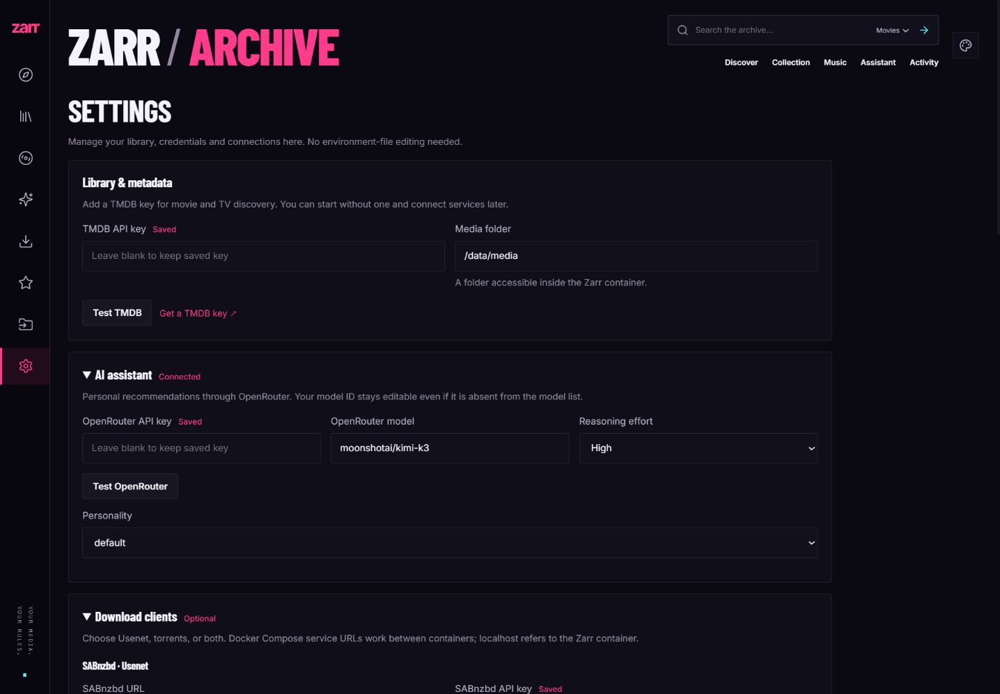
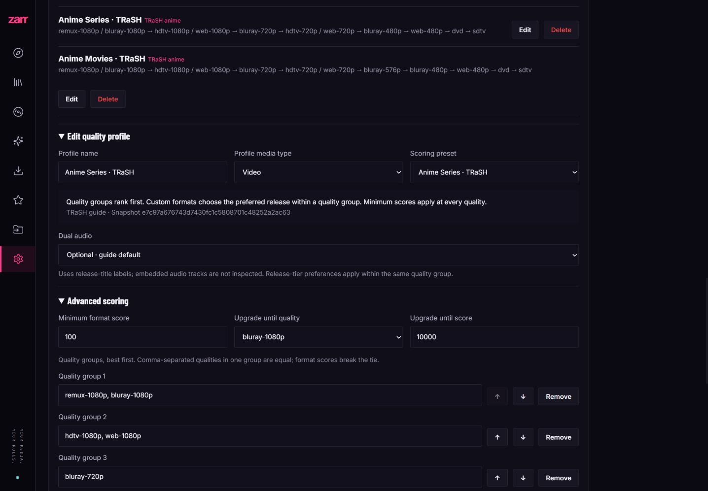
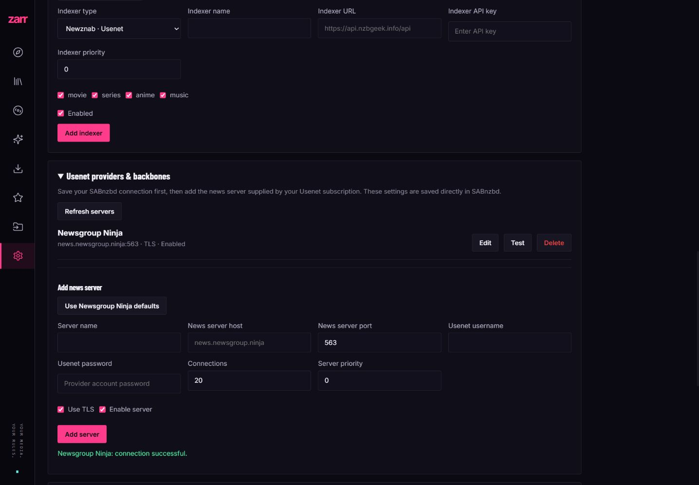

# Reliability and onboarding overhaul

This change builds on PR #1's Neon Archive interface. Three agents implemented and reviewed download/import behavior, domain/AI logic, and UI workflows; a second review checked the fixes and connection/bootstrap integration.

## Main corrections

- Import success now requires matching, successfully organized files. Season packs, episode selection, and multi-disc albums are handled explicitly. Failed or incomplete imports retain sources. Staged upgrades preserve old library files and torrent seed data, with rollback on errors.
- Cancellation, early torrent identification, failed retries, duplicate reservations, stalled search claims, scheduler completion, and seed cleanup now follow the actual client/import state. Empty libraries no longer make unnecessary downloader requests.
- qBittorrent 5.2 compatibility covers authenticated 204 responses, port-specific cookies, JSON torrent-add results, and reauthentication. Newznab/SAB responses and episode matching are validated.
- Library/season creation is transactional. Profiles are validated and protected while in use; ratings no longer inadvertently enqueue music. Import and delete paths are bounded, and scanners distinguish exact titles and remake years.
- OpenRouter streams preserve opaque reasoning details and tool-call IDs, report interrupted/provider errors, obey cancellation, and serialize conversation turns across settings changes. Defaults are Kimi K3 and high reasoning.
- Settings updates are atomic; secret list responses are blank/configured flags, blank edits preserve credentials, and tests do not modify active services. Proxy changes reach existing clients immediately. Per-request service snapshots keep slow model streams from blocking Settings.
- Fresh Compose installs generate unique downloader credentials and share correct paths. UI quick start allows immediate library access; Settings manages metadata/AI keys, clients, editable indexers, and SABnzbd-backed Usenet providers.
- The frontend now uses a compatible Svelte 5 / Kit 2 / Vite 7 stack. Assistant races/stream decoding, music artist links, stale responses, profile selection, and mobile/keyboard workflows have regression coverage.

## Verification on 2026-10-03

- **61 Go test cases/subtests** passed with the race detector on Windows. The entire race suite also passed inside the Linux Docker build image; `go vet ./...` passed.
- **27 Playwright tests** passed against the production frontend. `npm audit` reported zero vulnerabilities. Desktop and narrow live layouts were visually checked.
- Production Docker build and actual app startup/migrations passed.
- A separate empty Compose installation automatically connected both SABnzbd and qBittorrent, returned an empty Usenet server list, and allowed setup without metadata keys. Temporary test containers were removed afterward.
- Live TMDB authentication/search/metadata, movie library add/delete, and NZBGeek release search passed. The temporary movie record was removed.
- Live OpenRouter Kimi K3/high reasoning completed a streamed tool call, persisted reasoning/tool history, and completed a follow-up message. Authentication uses the key endpoint without billing a completion.
- Live Newsgroup Ninja TLS/NNTP authentication, SABnzbd API authentication, and qBittorrent API authentication passed. Connection tests were also exercised through the actual UI.
- A private, trackerless synthetic torrent using our own small payload passed add, category/tag identification, local piece verification (`progress=1`), seeding-state polling, and deletion in qBittorrent. No user torrents were changed.
- **144 simultaneous/batched live API operations** across Settings, profiles, indexers, and library returned success after the SQLite initialization fix.
- Compared tracked/new source files against all five supplied credential values: no matches. Runtime data, downloaded source references, temporary logs, and local test files remain excluded from Git and image context.

## Follow-up verification on 2026-10-04

- Fixed Settings control alignment, checked at 1440, 1024, 768, 390 and 320 pixels with saved and empty credentials.
- All **31 Playwright tests** passed; the strengthened mixed-result recommendation test also passed after review. Full Go race suite and `go vet ./...` passed after the backend changes.
- Rebuilt and restarted the production Docker app. Live Anime search returns **Chainsaw Man (2022), TMDB 114410, series** and **Chainsaw Man - The Movie: Reze Arc (2025), TMDB 1218925, movie**. Both metadata endpoints preserve anime classification; the film has no seasons field.
- Regression coverage exercises mixed movie/TV discovery, TMDB namespace collisions, TMDB/AniList additions, movie imports/scans, anime-only indexers across manual and scheduled searches, recommendation selection, movie/episode release separation, BD source aliases and combined-episode source retention.
- No Chainsaw Man media was downloaded. Search and metadata checks used live TMDB; library creation, download routing and imports used isolated test fixtures.
- [TRaSH anime scoring audit](anime-quality-audit.md) records the baseline gaps before the alignment work below.

## TRaSH alignment verification on 2026-10-04

- Bundled the upstream Sonarr/Radarr anime profile definitions at `e7c97a676743d7430fc1c5808701c48252a2ac63`, including 41/31 custom formats, unmodified source JSON, MIT license, integrity manifest, and an explicit update script.
- Added grouped quality ranking, upstream condition semantics and source mappings, minimum scores, revision/service/group preferences, dual-audio modes, quality/format cutoffs, and matched-format explanations. Regression tests check source constraints, negative guards, explicit zero overrides, preference round trips, and manifest/source parity.
- Implemented bounded automatic upgrades and dual-number anime searches. Tests cover cutoff-aware candidate selection, cooldowns, duplicate reservations, failed downloads, retained sources, cancellation, profile/baseline changes, same/different-extension rollback, and preservation of torrent seeding data.
- A second agent review found and fixed stale scanner provenance, custom cutoffs hiding eligible format upgrades, and missing supported trailing dual-audio labels. Twelve scanner cases cover stored/history baselines and same/changed paths without altering media bytes.
- Existing profile definitions and library assignments survive migration unchanged. New additions and imports choose the appropriate anime movie/series preset when no explicit profile is supplied. API tests verify real ranking order, rejection reasons and explanation metadata.
- Full `go test -race ./...` and `go vet ./...` passed. Production frontend build and all **38 Playwright tests** passed.
- Production Docker build/startup and the live profile API passed. The API exposes both pinned presets alongside the four original profiles. Desktop and 390-pixel mobile profile editors were visually checked; browser tests also cover 320 pixels and credential field alignment.

See [Anime quality profiles](anime-quality-profiles.md) for usage and remaining differences from Sonarr/Radarr, including title-based audio inference, MediaInfo, size limits and naming.

## Scope limits

No full Usenet media payload was downloaded, and no external torrent swarm was used. Those network transfer paths are covered by authenticated live checks plus mocked lifecycle/import regression tests. Rutracker scraping was not exercised against a real account. Combined multi-episode files that cannot be matched safely fail explicitly for manual handling and keep their source. This application remains a single-user local service; web ports bind to localhost by default.

